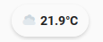

# Custom Chip - Temperature

 
## Description
 
This chip displays a weather condition icon together with outside temperature.
It can also display an inside temperature alongside if so configured.

The difference between this chip and the one provided with Minimalist is, well
minimal. This chip will display `°C` instead of just a degrees symbol.

## Variables
| Variable                     | Default | Required | Description                                                                                                                                                                            |
|------------------------------|---------|:--------:|----------------------------------------------------------------------------------------------------------------------------------------------------------------------------------------|
| ulm_chip_temperature_outside |         | ✅       | This is the sensor that provides your outside temperature value from your weather provider.  The state of this sensor should represent a numeric value with a unit of degrees Celsuis. |
| ulm_chip_temperature_inside  |         | ❎       | This is the sensor that provides your inside temperature.  The state of this sensor should represent a numeric value with a unit of degrees Celsuis.                                   |
| ulm_chip_temperature_weather |         | ✅       | This is the sensor for your weather entity.                                                                                                                                            |

## Usage
```yaml
- type: custom:button-card
  template: custom_chip_asmodai_temperature
  variables:
    ulm_chip_temperature_inside: sensor.my_internal_temperature_sensor
    ulm_chip_temperature_outside: sensor.my_external_temperature_sensor
    ulm_chip_temperature_Weather: weather.my_weather_provider
```
