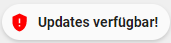
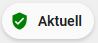

# Custom Chip - Update



## Description
This chip will show you if an update for Home Assistant is available.

This chip differs from the one included with Minimalist in that there is no
tap action.

The reason for this is that my Home Assistant installation is running inside
a Docker container rather than via the Home Assistant OS, so there is no
supervisor.  All HA updates are performed via shell scripts.

## Usage
```yaml
- type: custom:button-card
  template: custom_chip_asmodai_upgrade
  entity: binary_sensor.home_assistant_versions_update_available
```

Where `binary_sensor.home_assistant_versions_update_available` is a sensor
that is available via the "Version" integration.

## Variables
None.

## Requirements
If you don't have an update sensor, you can follow the instructions
[here](https://github.com/basbruss/UI/blob/main/custom_cards/custom_card_homeassistant_updates/README.md)
to create one.

## Credits
- Original Author: JeffConrad18 - 2022
- Author: Paul Ward - 2023
